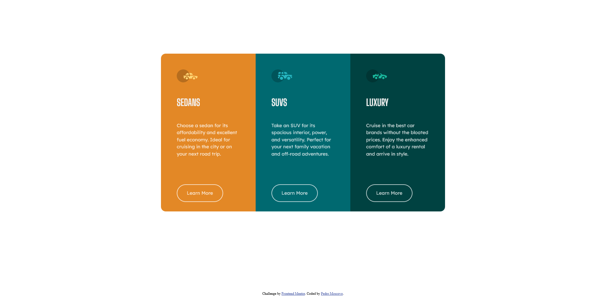
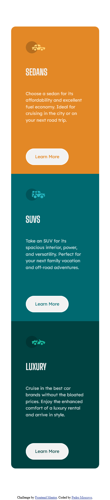

# Frontend Mentor - 3-column preview card component solution

This is a solution to the [3-column preview card component challenge on Frontend Mentor](https://www.frontendmentor.io/challenges/3column-preview-card-component-pH92eAR2-). Frontend Mentor challenges help you improve your coding skills by building realistic projects. 

## Table of contents

- [Overview](#overview)
  - [Screenshot](#screenshot)
  - [Links](#links)
- [My process](#my-process)
  - [Built with](#built-with)
- [Author](#author)
- [Acknowledgments](#acknowledgments)

## Overview

    First project from Front End Mentor after watching some courses. I do know it is basic and that's why I would really appreciate some feedback. After going back and forth to courses and Google I still think there is excess of coding on some parts but I just really focused on getting it to look similar to the challenge.

### Screenshot
<!-- Desktop -->

<!-- Mobile -->

### Links

- Solution URL: [Front end mentor solution](https://www.frontendmentor.io/solutions/3-column-preview-project-9fdOuyM9o)
- Live Site URL: [Netlify](https://3columnpreview-pedromoscovo.netlify.app/)

## My process

### Built with

- HTML
- CSS
- Flexbox

## Author

- Website - [Pedro Moscovo](No website yet)
- Frontend Mentor - [@pedromoscovo](https://www.frontendmentor.io/profile/PedroMoscovo)
- Instagram - [@pedromoscovo](https://www.instagram.com/pedromoscovo)

## Acknowledgments

Really addicted to these projects from frontendmentor, what a great way to build porfolio.
Aiming to get hired this year!
